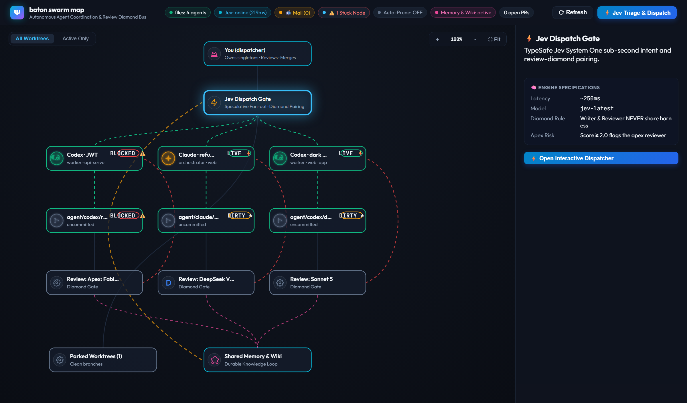
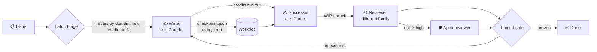

<div align="center">

# 🏃‍♂️ baton

### Hand a coding job from one AI agent to the next — without dropping it.

**Claude Code runs out of credits mid-task. Codex picks up exactly where it stopped. A different model reviews the work. Nothing is lost, nothing ships unproven.**

[](LICENSE)
[](package.json)
[](package.json)
[](tests)
[](#-works-with)

[Quick start](#-quick-start) · [How it works](#-how-it-works) · [Features](#-features) · [Docs](#-docs) · [FAQ](#-faq)



<sub>The swarm map: live agents, their worktrees, checkpoint state (live, dirty, blocked) and each one's cross-family reviewer.</sub>

</div>

---

## The problem

You're running more than one AI coding agent. Then this happens:

- 🪫 **An agent hits its credit limit halfway through a ticket.** The context dies with the chat. The next agent starts from zero.
- 🪞 **The model that wrote the code also "reviews" it.** Same blind spots, same bugs, rubber-stamped.
- ✅ **"All tests pass!"** — with no output, no proof, and no test that ever failed without the fix.
- 💥 **Two agents edit the same folder.** Or a cleanup script deletes a worktree an agent was still using.
- 🚀 **An agent "helpfully" deploys to production.**

**baton is the relay protocol that fixes this.** It's a small, zero-dependency Node toolkit that sits beside the agents you already use. It doesn't replace them, wrap them, or need an account, and it runs on macOS, Linux and Windows.

## ✨ Features

| | |
|---|---|
| 📍 **Checkpoints, not chat history** | Every agent writes `checkpoint.json` each loop — goal, what's proven, what's blocked, the exact next step. A successor resumes from the file, not a dead conversation. |
| 🔀 **Cross-model routing** | A roster of seats (writer, reviewer, apex reviewer, bulk, research) with tiers and model families. baton picks the writer and a reviewer **from a different model family**. Deterministic: no LLM picks who does the work. Classification runs offline by default; plug in [TypeSafe](https://typesafe.ai) for sharper answers. |
| 🪫 **Credit-death fallbacks** | Mark a credit pool as out until a date. Its seats are skipped; baton walks the fallback chain **sideways or down a tier, never up**, and an unavailable model never blocks the work. |
| 🧾 **Completion gate** | `done` requires a receipt: real command output, a negative control, the right reviews bound to a commit SHA. Claims of production deploys get flagged as a singleton breach. |
| 🌳 **Worktree safety** | One writer per git worktree. One script gives every fresh worktree the main checkout's dependencies and local config. The prune guard **never** deletes a worktree with an agent in it. |
| 🗺️ **Swarm map** | A local web page: running agents, worktrees, checkpoints, open PRs, and an interactive dispatcher. |
| 🔌 **Bring your own launcher** | Agents register with a one-line CLI, or baton reads [Paseo](https://paseo.sh) automatically. Add your own in ~30 lines. |

## 🧭 How it works



1. **Triage** classifies the issue (domain, risk, whether it needs an apex review) and the **roster** deterministically names the writer and reviewers.
2. The **writer** works in its own worktree and writes `checkpoint.json` every loop.
3. If it dies, a **successor** — any harness — reads the checkpoint and carries on.
4. A **reviewer from a different model family** checks the committed branch. High-risk work also gets an **apex review** (unless a frontier model wrote it: *frontier doesn't review frontier*).
5. The **receipt gate** decides whether it's actually done.

## 🚀 Quick start

Requires **Node 20+** and git. That's it.

```bash
git clone https://github.com/immy2good/baton && cd baton
npm test
```

**Tell baton what's running:**

```bash
node scripts/agents.mjs register --id claude-1 --provider claude
node scripts/agents.mjs list
#   launcher files: 1 agent(s)
#     claude-1   running  claude   /code/web-app
node scripts/agents.mjs done --id claude-1
```

**Route an issue.** Works offline out of the box; set `TYPESAFE_API_KEY` to classify with [TypeSafe](https://typesafe.ai) instead of local keywords:

```bash
node scripts/dispatch-triage.mjs "Fix rounding in the refund calculation"
#   Domain:              critical_systems (confidence: 1)
#   Risk Score:          3 / 3.0
#   Assigned Writer:     T2 Implementer (Opus 5 medium) [T2]
#   Reviewer:            Cross-model Reviewer (DeepSeek V4 Pro, plan)
#   Apex Review Needed:  YES
#   Classifier:          offline-keywords
```

Vague tickets aren't guessed at: low confidence escalates to you instead of routing.

**Gate a completion receipt** (the bundled example is deliberately weak, and gets rejected):

```bash
node scripts/receipt-gate.mjs docs/schemas/examples/receipt.valid.json
#   Gate Verdict:    REJECT_INSUFFICIENT_PROOF
#   Findings:        Evidence missing executable proof: verified items must cite
#                    commands, exit status, or test runner output
```

**Open the swarm map** at http://127.0.0.1:8766:

```bash
npm run map
```

## 📍 A checkpoint looks like this

```json
{
  "schema_version": 1,
  "ticket": "https://github.com/acme/web-app/issues/123",
  "node": "claude",
  "repo": "web-app",
  "branch": "agent/claude/fix-session-timeout",
  "goal": "Fix session timeout regression after login",
  "updated_at": "2026-09-19T22:00:00Z",
  "proven": ["npm test: 212 passed; new timeout test fails without the fix"],
  "blocked": [],
  "next": "Ask the reviewer seat to check out the WIP branch"
}
```

Any agent that can read a file can resume from it. That's the whole trick.

## 🤝 Works with

Claude Code · OpenAI Codex · Cursor (ACP) · OpenCode · Antigravity · Perplexity (research seat) — anything you can describe as a provider + model in [`roster/profiles.json`](roster/profiles.json).

## 🛠️ Make it yours

| File | What it controls |
|---|---|
| [`roster/profiles.json`](roster/profiles.json) | The agents you run: provider, model, mode, thinking level. Or point `BATON_PROFILES` at a private file. |
| [`roster/routing.json`](roster/routing.json) | Tiers, families, roles, fallback chains, domain specialists, the active-agent cap. |
| [`roster/pools.json`](roster/pools.json) | Credit pools that are out until a date. |
| [`src/lib/contract-lint.mjs`](src/lib/contract-lint.mjs) | Cross-repo contracts your repos share. |
| `baton.json` (per repo) | Worktree setup lines — [details](docs/WORKTREE-ENVIRONMENT.md). |
| `config/swarm-map.json` | Repos the map watches (gitignored; copy [the example](config/examples/swarm-map.json)). |

## 📚 Docs

- **[Principles](docs/PRINCIPLES.md)** — the rules baton enforces, and why
- **[Launchers](docs/LAUNCHERS.md)** — `files` (default), Paseo, or your own
- **[Startup preflight](docs/STARTUP-PREFLIGHT.md)** and **[completion gate](docs/COMPLETION-GATE.md)** — what an agent does first and last
- **[Risk classification](docs/RISK-CLASSIFICATION.md)** · **[Checkpoint schema](docs/CHECKPOINT-SCHEMA.md)** · **[Worktree environment](docs/WORKTREE-ENVIRONMENT.md)**
- Templates: **[repo `AGENTS.md`](docs/templates/REPO-AGENTS-TEMPLATE.md)** · **[task packet](docs/templates/TASK-PACKET.md)** · **[review-diamond recipe](docs/recipes/review-diamond.yml)**

## ❓ FAQ

**Is this another agent framework?**
No. baton never runs a model. It's the protocol and guardrails *between* the agents you already use.

**Do I need Paseo?**
No. The default launcher is a folder of JSON files. Paseo is detected automatically if you have it.

**Do I need the TypeSafe key?**
No. Issue classification runs offline with a keyword classifier that escalates when unsure. A [TypeSafe](https://typesafe.ai) key gives sharper classification and powers the receipt gate's semantic checks. Routing, fallbacks, checkpoints and worktree tools never need it.

**Does it work on macOS and Linux?**
Yes. Everything is Node. Worktree setup lines run in `sh` on macOS/Linux and PowerShell on Windows, and you pick per repo.

**Why "a reviewer from a different family"?**
A model reviewing its own family's code shares its blind spots. baton enforces writer ≠ reviewer *family*, not just writer ≠ reviewer.

**What's a "negative control"?**
Proof the test catches the bug: revert the fix, watch the test fail, restore it, watch it pass. A green suite proves nothing until you've seen it go red.

## 🧪 Tests

```bash
npm test               # unit tests; live TypeSafe tests skip without a key
npm run test:worktree  # end-to-end worktree setup check in a scratch repo
```

## 🤲 Contributing

Issues and PRs welcome, especially new [launchers](docs/LAUNCHERS.md) and harness adapters (`src/lib/adapters/`). See [CONTRIBUTING.md](CONTRIBUTING.md): zero dependencies, and every change comes with a test you've seen fail.

## 📄 Licence

[MIT](LICENSE) — if baton saves one of your agents from a credit-death, a ⭐ helps others find it.
